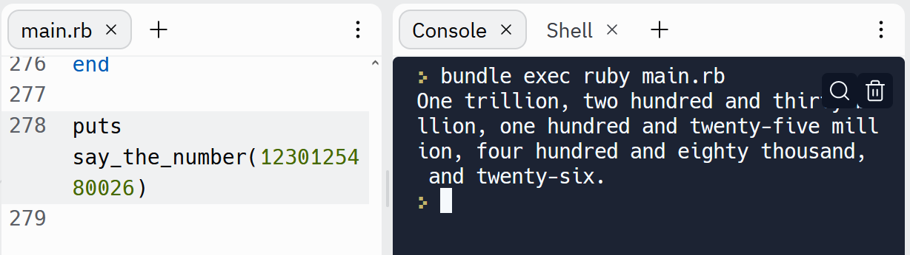

# SECTION C

> ## say_the_number  using Ruby programming language

### __Ruby__ is the programming language I used to attempt the solution

[code on my git hub repo](https://github.com/T-WaRa-N/HDFLHTC "say_the_number")

* git clone in to your local machine
* I suggest you run it on replit or VS Code locally

The challenge was breaking-down the problem into solvable chunks, it took me sometime and I finally decided on a logic. It is a doable project I manage to finish 50% with the time I had in the time fram I was given. I did not include test suits in this submission. The logic I chose took me  time and I did not have enough time on these days I got the problem other than that the level of difficulty is fair and if I could be given extra time, with your persmission I can solve the problem well. 

The problem become more complex as I get to close to the solution and way approach was ok not satisfying though it worked.

> ## Runnin example in the image below


The code can be found on the Git hup repo mentioned above, my focus was correctness more than style, efficiency and documentation. Please see the test suit done online for this problem because of time please accept computer based testing.

```Text File
One thousand and one.
Test Passed: Value == "Zero."
Test Passed: Value == "Eleven."
Test Passed: Value == "Fourteen."
Test Passed: Value == "Fifteen."
Test Passed: Value == "Forty-three."
Test Passed: Value == "Fifty."
Test Passed: Value == "One thousand and one."
FAILED: Expected: "Twenty thousand.", instead got: "Twenty thousand ."
ERROR:  `expect': Expected: "Twenty thousand.", instead got: "Twenty thousand ." (Test::Error)
 from `assert_equals'
 from `<main>'
```

